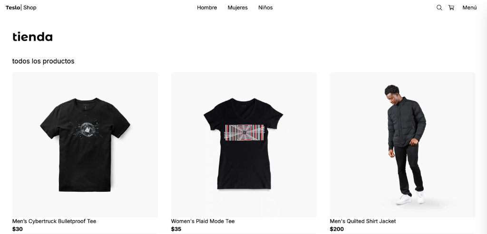

# Teslo Shop | Full Stack E-commerce | UI + Architecture (Next.js/React/TS)




A modern, high-performance E-commerce application inspired by the Tesla Shop. Built with **Next.js 14**, this project demonstrates a robust full-stack architecture, featuring secure authentication, server-side state management, and seamless payments.

## 🚀 Key Features

- **🛒 Full E-commerce Flow:** Browse products, filter by category, manage cart (Zustand), and checkout.
- **🔒 Secure Authentication:** Credentials and OAuth provider integration using **NextAuth.js v5**.
- **💳 Payments Integration:** Fully functional PayPal checkout with order verification.
- **🛡️ Admin Dashboard:** comprehensive panel to manage products, orders, and users.
- **☁️ Cloud Integration:** Image uploads and optimization via **Cloudinary**.
- **🗄️ Database Management:** Type-safe database interactions using **Prisma ORM** with **PostgreSQL**.
- **🎨 Responsive Design:** Mobile-first approach using **Tailwind CSS**.

## 🛠️ Tech Stack

- **Framework:** [Next.js 14](https://nextjs.org/) (App Router, Server Actions)
- **Language:** [TypeScript](https://www.typescriptlang.org/)
- **Styling:** [Tailwind CSS](https://tailwindcss.com/)
- **Database:** [PostgreSQL](https://www.postgresql.org/)
- **ORM:** [Prisma](https://www.prisma.io/)
- **State Management:** [Zustand](https://github.com/pmndrs/zustand)
- **Auth:** [NextAuth.js](https://next-auth.js.org/)
- **Forms:** [React Hook Form](https://react-hook-form.com/) + [Zod](https://zod.dev/)
- **Payments:** [PayPal SDK](https://developer.paypal.com/docs/business/checkout/configure-payments/single-page-app/)

---

## 🏁 Getting Started

Follow these instructions to set up the project locally.

### Prerequisites

- Node.js (LTS recommended)
- Docker (for the database)

### Installation

1.  **Clone the repository:**

    ```bash
    git clone https://github.com/bryan-delacruz/next-teslo-shop.git
    cd next-teslo-shop
    ```

2.  **Environment Setup:**
    Duplicate `.env.template` and rename it to `.env`. Fill in your environment variables (Database URL, NextAuth secret, PayPal credentials, Cloudinary keys).

    ```bash
    cp .env.template .env
    ```

3.  **Install Dependencies:**

    ```bash
    npm install
    ```

4.  **Start Database:**
    Launch the PostgreSQL container.

    ```bash
    docker compose up -d
    ```

5.  **Run Migrations:**
    Apply the Prisma schema to your database.

    ```bash
    npx prisma migrate dev
    ```

6.  **Seed Database:**
    Populate the database with initial product and user data.

    ```bash
    npm run seed
    ```

7.  **Run Development Server:**
    ```bash
    npm run dev
    ```
    Open [http://localhost:3000](http://localhost:3000) in your browser.

---

## 🇪🇸 Instrucciones en Español (Original)

### Correr en Dev

1.  Clonar el repositorio
2.  Crear una copia del `.env.template` y renombrarlo a `.env` y cambiar las variables de entorno
3.  Instalar las dependencias `npm install`
4.  Levantar la base de datos `docker compose up -d`
5.  Correr las migraciones de Prisma `npx prisma migrate dev`
6.  Ejecutar seed `npm run seed`
7.  Correr el proyecto `npm run dev`
8.  Limpiar el localStorage del navegador

### Correr en Prod

(Configuración pendiente de documentar)
