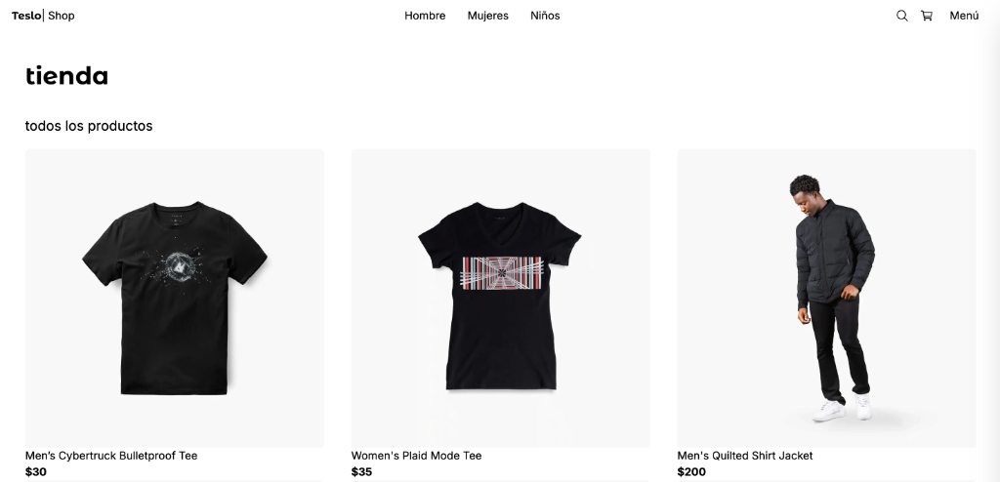

# Teslo Shop

[🇪🇸 Leer en español](./README.es.md)

Full stack clothing store inspired by the Tesla Shop: catalog, cart, checkout with PayPal and an admin panel for products, orders and users.

**Live demo:** [teslo-shop-bdlc.vercel.app](https://teslo-shop-bdlc.vercel.app/)



## What it does

- **Catalog.** Paginated product grid, filtered by gender (men, women, kids), with a product page per item showing a sizes picker and live stock.
- **Cart and checkout.** Cart kept in a Zustand store; checkout with a saved shipping address.
- **Orders.** Placing an order runs in a Prisma transaction that checks and decrements stock, so an order never sells more than what is available.
- **Payments.** PayPal checkout. The server asks PayPal for the order status and only marks the order as paid when it is `COMPLETED`.
- **Accounts.** Sign up and sign in with email and password (NextAuth v5, bcrypt-hashed passwords). Order history per user.
- **Admin panel.** Behind a role check in the middleware: create and edit products, upload images to Cloudinary, see every order and change user roles.

## How it's built

| Area | Choice |
| --- | --- |
| App | Next.js 14 (App Router, Server Actions), React 18, TypeScript |
| Data | PostgreSQL with Prisma; Docker Compose for the local database |
| Auth | NextAuth v5 with the credentials provider; `user` and `admin` roles |
| Forms | React Hook Form and Zod |
| State | Zustand for the cart, the checkout address and the UI |
| Payments | PayPal JS SDK on the client, PayPal REST API for server-side verification |
| Images | Cloudinary |
| UI | Tailwind CSS, Swiper for the product galleries |

## Run it locally

You need Node.js (LTS) and Docker.

```bash
git clone https://github.com/bryan-delacruz/next-teslo-shop.git
cd next-teslo-shop
cp .env.template .env      # fill in the database URL, auth secret, PayPal and Cloudinary keys
npm install
docker compose up -d       # PostgreSQL
npx prisma migrate dev
npm run seed               # sample products and users
npm run dev
```

Open [localhost:3000](http://localhost:3000). If the cart shows stale items from an earlier run, clear the browser's localStorage.
